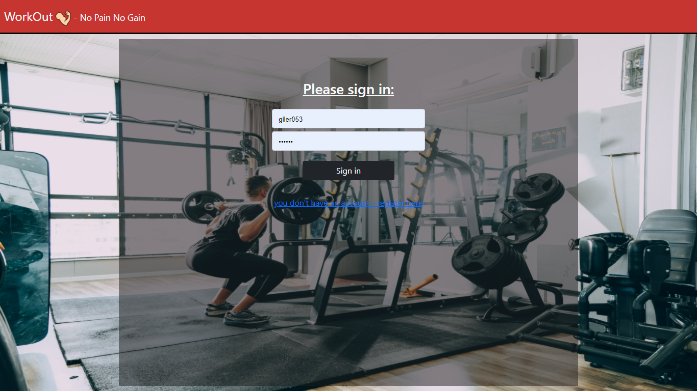
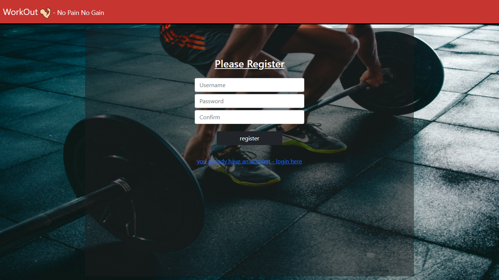
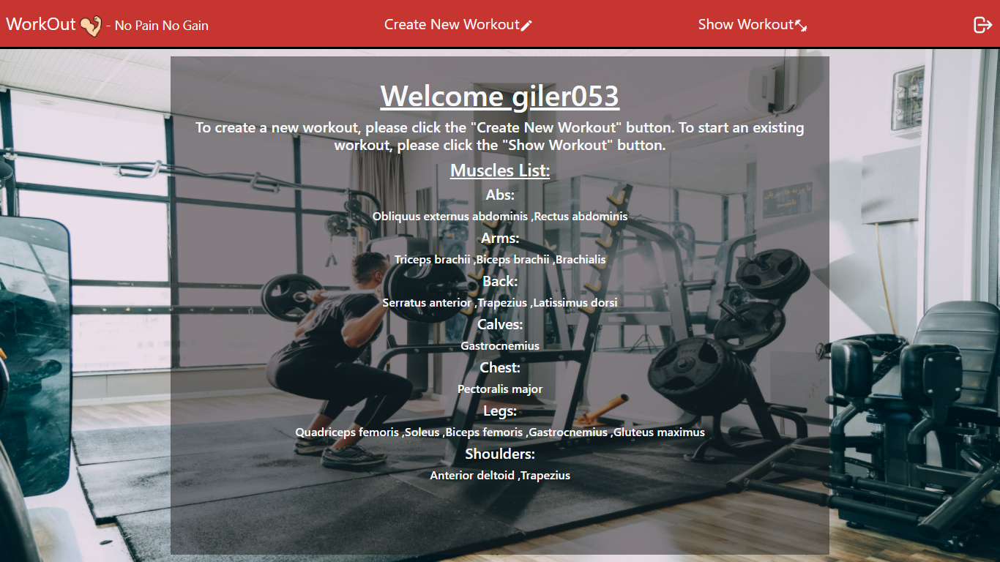
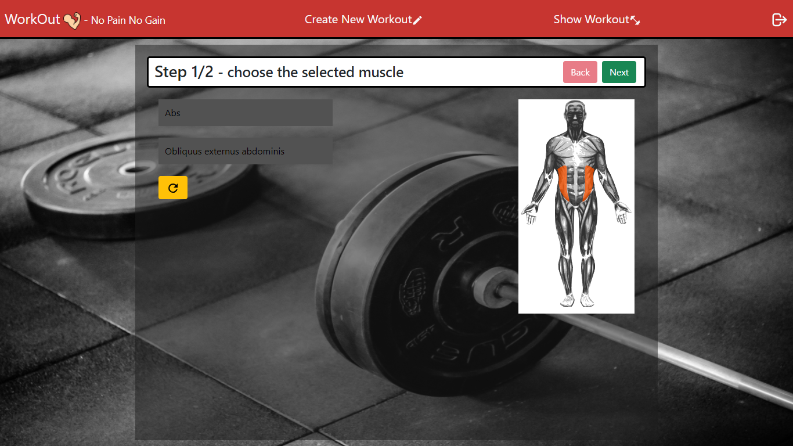
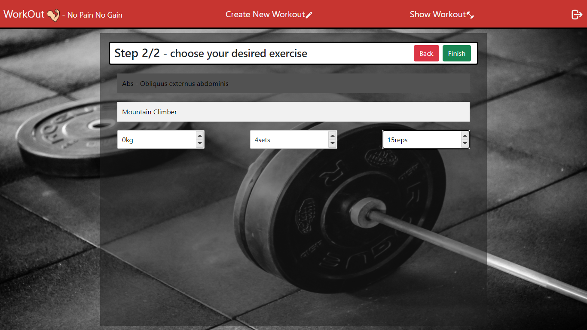
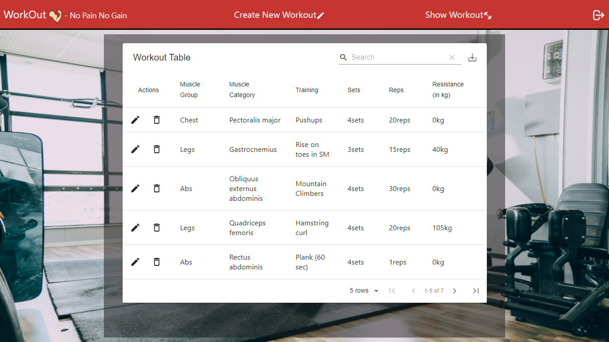

# Welcome to Workout!
Workout is a system for desigenning workout plan. The system allows the user to create a training program and export it to PDF/CSV file (as a table).
## Usage:
# [`The Server`](server/server.js):
```javascript
cd workout\server
npm install
npm start
```
# [`The Client`](webclient/src/index.js):
```javascript
cd workout\webclient
npm install
npm start
```
## pages:
### [`login page`](webclient/src/components/login.js):


### [`register page`](webclient/src/components/register.js):


### [`home page`](webclient/src/components/home.js):


### [`create workout page`](webclient/src/components/createNew.js):



### [`show workout page`](webclient/src/components/showWorkout.js):

